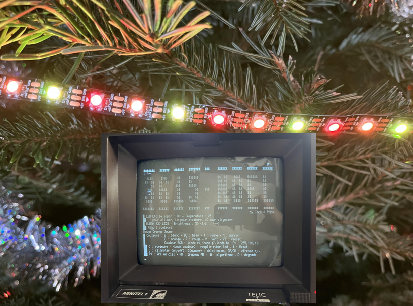
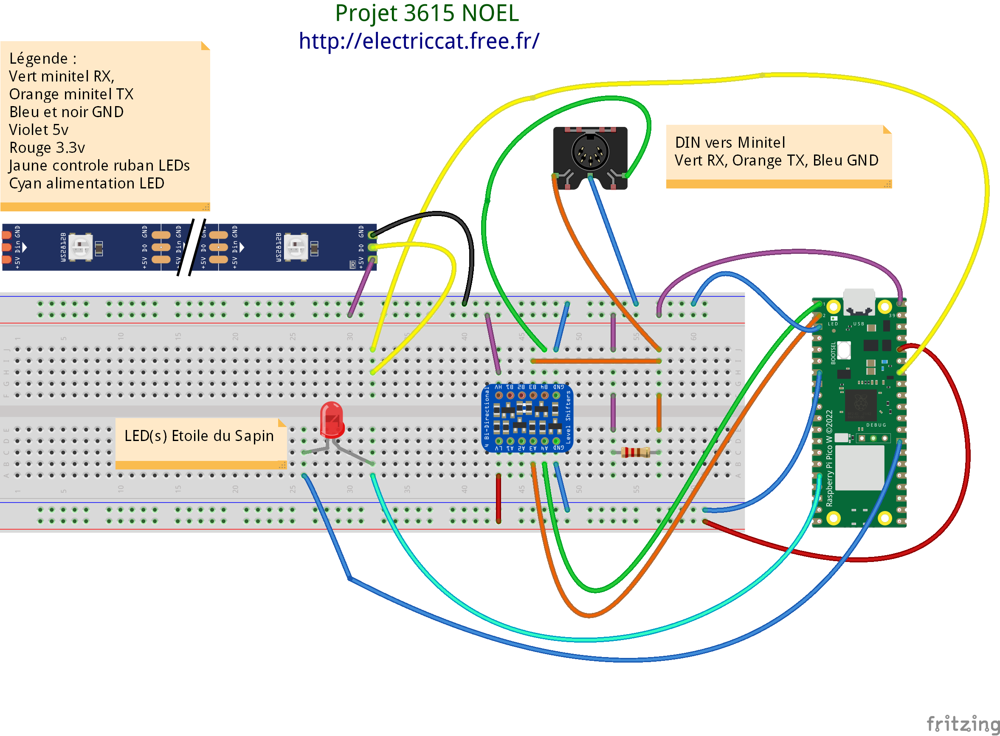

# 3615 Noel : Projet Raspberry Pico pour controler un ruban LED depuis un Minitel
Code en MicroPython à charger sur un Raspberry Pico W.

## Fichiers
* main.py : programme principal lancé automatiquement par le Pico au démarrage
* minitel.py : liaison série UART avec le minitel pour afficher le contenu à l'écran
* ledstrip.py : fonctions pour le ruban Led WS2812B

## Librairies externes
* [Neopixel](https://github.com/blaz-r/pi_pico_neopixel)
* [PicoZero](https://pypi.org/project/picozero/)

## Installation
Modifier le code du fichier main.py pour adapter le nombre de led à piloter en fonction des rubans leds installés.
Copier les 3 fichiers sur le Raspberry Pico.

Schéma Fritzing : 

Plus de détails disponibles sur le site [ElectricCat](http://electriccat.free.fr/3615noel/)

